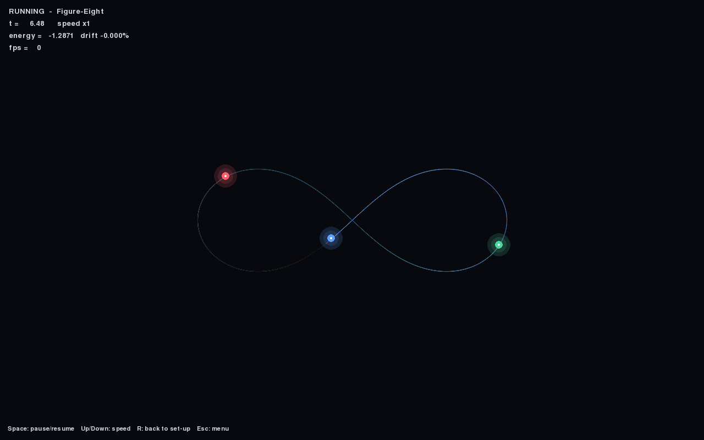

# The Three-Body Problem

A real-time, interactive simulator of the gravitational **three-body problem** — three
point masses orbiting one another under Newtonian gravity. Set up the initial conditions
by dragging the bodies around, then launch and watch the system evolve. Because the
three-body problem has no general closed-form solution, most configurations are
**chaotic**: a tiny nudge to the starting positions sends the orbits somewhere completely
different.



The integrator is **symplectic** (velocity Verlet / leapfrog), so total energy stays
essentially constant over long runs — you can watch the live energy-drift readout hover
around `0.000%` even after thousands of steps.

> This started as a prototype I wrote while studying maths and set aside for a few years.
> This is the rewrite: correct physics, a clean architecture, and tests.

## Features

- **Real-time symplectic integration** — velocity Verlet conserves energy and linear
  momentum, so orbits stay stable instead of spiralling out from numerical error.
- **Direct manipulation** — left-drag a body to move it, right-drag to set its velocity
  vector. No forms, no typing coordinates.
- **Famous presets** — the figure-eight choreography, the rotating Lagrange triangle, a
  sun-and-planets system, and a random generator.
- **Fading orbit trails** and a live HUD (time, total energy, energy drift, FPS).
- **Adjustable speed**, pause/resume, and reset — all from the keyboard.
- **Tested physics** — the engine is decoupled from the graphics and covered by a headless
  `pytest` suite (energy conservation, momentum conservation, figure-eight periodicity…).

## Install

Requires Python 3.10+.

```bash
git clone https://github.com/<your-user>/3BodyProblem.git
cd 3BodyProblem
python -m venv .venv && source .venv/bin/activate    # optional but recommended
pip install -r requirements.txt
```

## Run

```bash
python main.py
```

Press **Start**, then drag the bodies to taste and hit **Space** to launch.

## Controls

| Action | Control |
| --- | --- |
| Move a body | **Left-drag** it |
| Set a body's velocity | **Right-drag** from it (an arrow appears) |
| Launch / pause | **Space** |
| Simulation speed | **Up / Down** |
| Load a preset | **1** figure-8 · **2** Lagrange · **3** sun · **4** random |
| Reset to set-up | **R** |
| Toggle help / fullscreen | **H** / **F** |
| Back to menu | **Esc** |

## The physics

Each body feels the gravitational pull of the others:

$$\mathbf{a}_i = G \sum_{j \neq i} m_j \, \frac{\mathbf{r}_j - \mathbf{r}_i}{\left(\lVert \mathbf{r}_j - \mathbf{r}_i \rVert^2 + \varepsilon^2\right)^{3/2}}$$

The small **softening length** $\varepsilon$ removes the singularity when two bodies get
arbitrarily close (with $\varepsilon = 0$ this is exact Newtonian gravity, used by the
figure-eight and Lagrange presets).

Time is advanced with **velocity Verlet**:

$$
\mathbf{r}_{n+1} = \mathbf{r}_n + \mathbf{v}_n \, \Delta t + \tfrac12 \mathbf{a}_n \, \Delta t^2,
\qquad
\mathbf{v}_{n+1} = \mathbf{v}_n + \tfrac12 (\mathbf{a}_n + \mathbf{a}_{n+1}) \, \Delta t.
$$

This scheme is *symplectic*: unlike naive Euler integration it does not systematically
gain or lose energy, which is exactly what you want for orbital mechanics.

## Tests

```bash
pip install -e ".[dev]"
pytest
```

The suite runs headless (no window) and checks that momentum is conserved to machine
precision, that energy drift stays tiny over many orbits, and that the figure-eight
choreography returns to its starting point after one period.

## Project layout

```
threebody/
  physics.py    # System + velocity-Verlet integrator + conserved quantities (no pygame)
  presets.py    # figure-8, Lagrange triangle, sun & planets, random
  render.py     # camera, glowing bodies, fading trails, velocity arrows
  ui.py         # menu button, HUD, help overlay
  app.py        # window, state machine (menu / edit / run / paused), main loop
main.py         # entry point
tests/          # headless physics tests
```

## License

[MIT](LICENSE) © Daniel Sánchez Pagán
